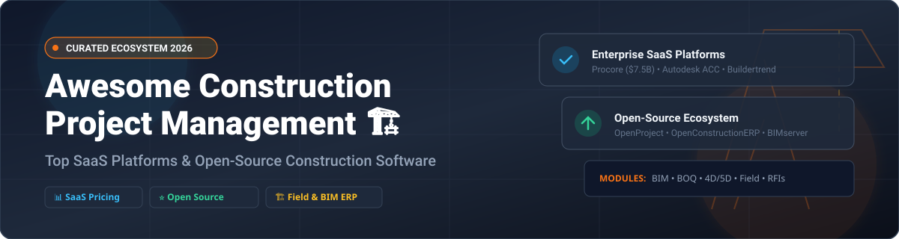

# 🏗️ Awesome Construction Project Management 🚀

  
  
  
  

---

## 📌 Top Construction Project Management Platforms Ecosystem 🏗️

A curated directory of **Construction Project Management Software**, **Construction ERPs**, **BIM Tools**, **Field Management Apps**, and **Open-Source Construction Solutions**. 

Whether you are a General Contractor (GC), Specialty Contractor, Subcontractor, Estimator, or Project Owner, this guide highlights top-tier enterprise SaaS platforms and self-hosted open-source software to streamline construction scheduling, cost estimation, RFIs, submittals, document control, and field operations.

> **Last updated: September 2026** 📅

---

## 📑 Table of Contents
- [💼 SaaS & Hosted Construction Platforms](#-saas--hosted-construction-platforms)
- [⚡ Open-Source Construction & PM Software](#-open-source-construction--pm-software)
- [🤝 How to Contribute](#-how-to-contribute)
- [💖 Support & Acknowledgments](#-support--acknowledgments)
- [📈 Star History](#-star-history)
- [⚠️ Disclaimer](#%EF%B8%8F-disclaimer)

---

## 💼 SaaS & Hosted Construction Platforms 🏢

### 📊 Industry Market Size & Fragmentation Analysis 📈
> **Market Size & Structure**: The global Construction Management Software market size is estimated at **$10.5 Billion - $12.8 Billion in 2026** (growing at ~10.2% CAGR). The sector is **moderately fragmented**—while market leaders like Autodesk Construction Cloud and Procore command significant share in enterprise general contracting, thousands of specialized, regional, and vertical-specific SaaS solutions (residential homebuilding, HVAC, civil, trade sub-contractors) maintain strong market share across niche segments.

### 📋 Comparison of Top Construction SaaS Solutions 💲
The table below lists leading commercial platforms sorted by **Company Size / Valuation (Descending)**:

| Platform 🛠️ | Company Size / Valuation 🏛️ | Starting Tier Pricing 💰 | Free Tier / Free Trial Limits 🎁 | Primary Focus Areas 🎯 |
| :--- | :--- | :--- | :--- | :--- |
| **[Autodesk Construction Cloud](https://construction.autodesk.com/)** 🏢 | **~$44.5B Market Cap** (Public: ADSK) | **$100,000/year** (Standard Tier starting price) | **30-Day Free Trial** (ACC Build & Docs full trial) | BIM, Field Collaboration, Enterprise Project Execution |
| **[Procore](https://www.procore.com/)** 🏗️ | **~$7.5B Market Cap** (Public: PCOR) | **$4,500/year** ($375/month base ACV tier) | **14-Day Custom Sandbox Demo / Trial** (Full module suite access) | Unlimited User PM, Financials, Quality & Safety |
| **[Fieldwire](https://www.fieldwire.com/)** 📱 | **$300M Valuation** (Acquired by Hilti) | **$39/user/month** (Pro plan billed annually) | **Free Forever Plan** (Max 5 users, 3 projects, 100 sheets) | Field Operations, Punch List, Blueprint Viewer |
| **[Buildertrend](https://www.buildertrend.com/)** 🏠 | **~$150M Annual Revenue** (Private, Bain Capital) | **$399/month** (Essential tier starting price) | **30-Day Money-Back Guarantee / Free Trial** | Residential Builders, Remodelers, Homeowners Portal |
| **[ProjectSight](https://www.trimble.com/en/products/projectsight)** 📐 | **Trimble Enterprise Unit** (NASDAQ: TRMB) | **$29/user/month** (ProjectSight Go plan) | **Free Forever Tier** (Core doc management for small teams) | Trimble Ecosystem, General Contractors & Subcontractors |
| **[Buildxact](https://www.buildxact.com/)** 🧮 | **Mid-Market Scale** (~$25M Revenue) | **$149/month** (Entry Foundation Plan) | **14-Day Free Trial** (Unlimited takeoffs & estimate tests) | AI Estimating, Takeoffs, Residential Cost Control |
| **[Contractor Foreman](https://www.contractorforeman.com/)** 🔨 | **Growth Scale** (Private SMB SaaS) | **$49/month** (Standard plan up to 3 users) | **30-Day Free Trial** (Full feature access with no credit card) | Small-to-Mid Contractors, Scheduling, Time Tracking |
| **[Jonas Construction Software](https://www.jonasconstruction.com/)** ⚙️ | **Constellation Software Unit** (TSX: CSU) | **$800/month** (Base Core Financial Modular tier) | **Custom Product Demo** (Guided trial instance on request) | Specialty Contractors, HVAC, Mechanical & Plumbing ERP |

---

## ⚡ Open-Source Construction & PM Software 💻

Self-hosted, transparent, and open-source project management solutions allow contractors, civil engineers, and developers to retain full data ownership without per-user licensing fees.

Sorted by **GitHub Stars_Count (Descending)** ⭐:

| Project 📦 | GitHub_Stars ⭐ | License 📜 | Tech Stack 💻 | Key Features & Capabilities 🚀 |
| :--- | :--- | :--- | :--- | :--- |
| **[OpenProject](https://github.com/opf/openproject)** 🚀 |  | GPL-3.0 | Ruby on Rails, Angular, PostgreSQL | Enterprise Gantt charts, BIM viewer, resource management, task workflows |
| **[Leantime](https://github.com/Leantime/leantime)** 🎯 |  | GPL-3.0 | PHP, MySQL, JavaScript | Lean project management, milestone planning, visual boards, time tracking |
| **[IfcOpenShell](https://github.com/IfcOpenShell/IfcOpenShell)** 🏢 |  | LGPL-3.0 | C++, Python | Open-source IFC building information modeling (BIM) parsing and extraction |
| **[BIMserver](https://github.com/opensourceBIM/BIMserver)** 🌐 |  | AGPL-3.0 | Java, IFC Standard | Centralized BIM model database server for openBIM collaboration and storage |
| **[OpenConstructionERP](https://github.com/datadrivenconstruction/OpenConstructionERP)** 🏗️ |  | AGPL-3.0 | Python 3.12, FastAPI, React 18 | All-in-one Construction ERP: BOQ editor, 120k cost items, submittals, 4D/5D scheduling |
| **[Taiga](https://github.com/kaleidos-ventures/taiga-back)** 📋 |  | MPL-2.0 | Python, Django, AngularJS | Agile project management, task tracking, issue logging for construction tech projects |
| **[gcOpen](https://github.com/ibuilder/gcOpen)** 🛠️ |  | MIT | JavaScript, Node.js | General Contractor site management, site daily logs, safety reporting tools |

---

## 🤝 How to Contribute 💡

Contributions to expand this curated list are welcome! 

1. 🍴 **Fork** the repository.
2. 📝 Add or edit entries in `README.md` following the existing tabular format.
3. 🔍 Ensure description, pricing, and star links are accurate and factual.
4. 📬 Submit a **Pull Request** with a clear explanation of your changes.

---

## 💖 Support & Acknowledgments 🙏

Thank you for exploring and using **Awesome-Construction-Project-Management**! 🌟

If you find this repository helpful, please consider supporting the project:
- ⭐ **Star** this repository on GitHub to increase visibility.
- 🔀 **Fork** and share it with fellow civil engineers, contractors, and builders.
- ☕ **Sponsor & Buy Me a Coffee**: Show your appreciation on the [GitHub Sponsor Dashboard](https://github.com/sponsors/ishandutta2007).

---

## 📈 Star History

---

## ⚠️ Disclaimer 📜

- This list is **community-curated** for informational and educational purposes.
- Construction project management platforms handle sensitive contract, financial, and architectural data. Ensure proper compliance and testing before deploying in production environments.
- Open-source platforms like **OpenConstructionERP** and **OpenProject** offer zero per-seat licensing costs, whereas commercial SaaS platforms (Procore, Autodesk ACC) deliver extensive turnkey support and third-party integrations.

---

  Made with ❤️ for general contractors, project managers, estimators, and construction technologists.

